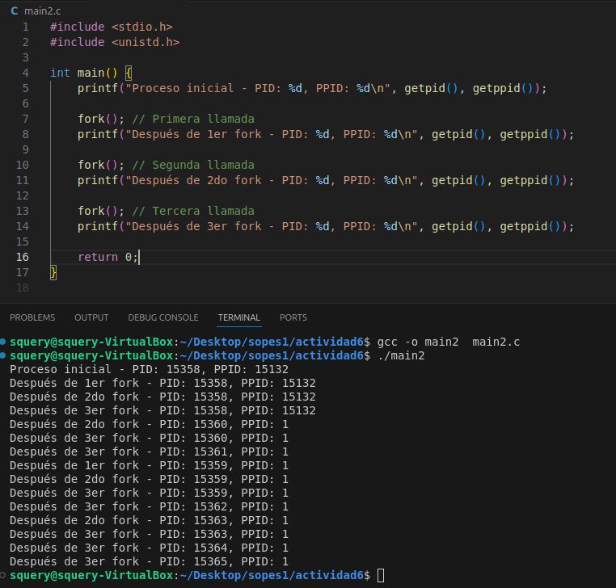
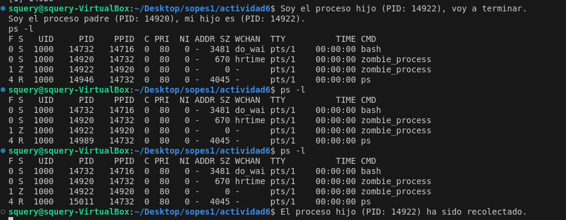
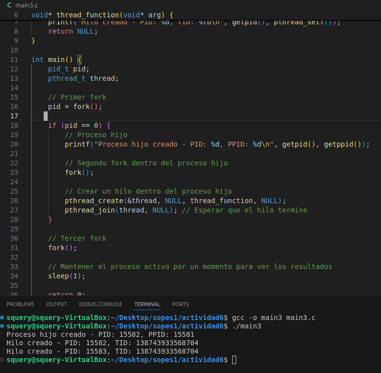

# Actividad 6 - Procesos e Hilos

### Problema 1

¿Incluyendo el proceso inicial, cuántos procesos son creados por el siguiente programa?

5

### Problema 2

Utilizando un sistema Linux, escriba un programa en C que cree un proceso hijo (fork) que finalmente se convierta en un proceso zombie. Este proceso debe permanecer en el sisema durante al menos 60 segundos. Los estados del proceso se pueden obtener del comando> ps -l

### Problema 3

Usando el siguiente codigo como referencia, completar el programa para que se ejecutable y responder las siguientes preguntas.

- ¿Cuántos procesos único son creados?
- ¿Cuántos hijos únicos son creados?

1. 1 proceso único

2. 2 hilos únicos
